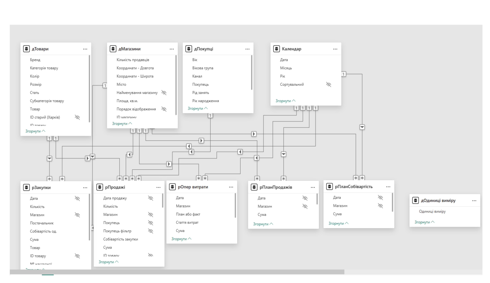

# Power-BI-Sales-Analysis

Навчальний проєкт Power BI з аналізу продажів, асортименту та клієнтських сегментів.

## 🎯 Мета проєкту
Проаналізувати продажі компанії, оцінити ефективність товарних категорій, клієнтських сегментів та товарних запасів.

## 🧰 Інструменти
- Power BI Desktop
- Power Query
- DAX
- Excel

  ## 📈 Результати
- Побудовано модель даних для аналізу продажів
- Створено інтерактивні дашборди в Power BI
- Реалізовано KPI продажів та прибутковості
- Виконано аналіз товарних залишків
- Розроблено DAX-міри для бізнес-аналітики

## 📊 Основні показники
### Продажі в розрізі магазинів, брендів та категорій товарів
  
### Динаміка росту продажів по роках
  
### План-факт аналіз операційних витрат
  
### План-факт аналіз чистого прибутку
  
### Середній чек
  
### Аналіз товарних залишків
   

## 🧠 Навички, продемонстровані в проєкті
- Очищення та підготовка даних у Power Query  
- Побудова моделі даних
  
- Створення зв’язків між таблицями  
- Написання DAX-мір  
- Візуалізація даних  
- Аналіз бізнес-показників  
