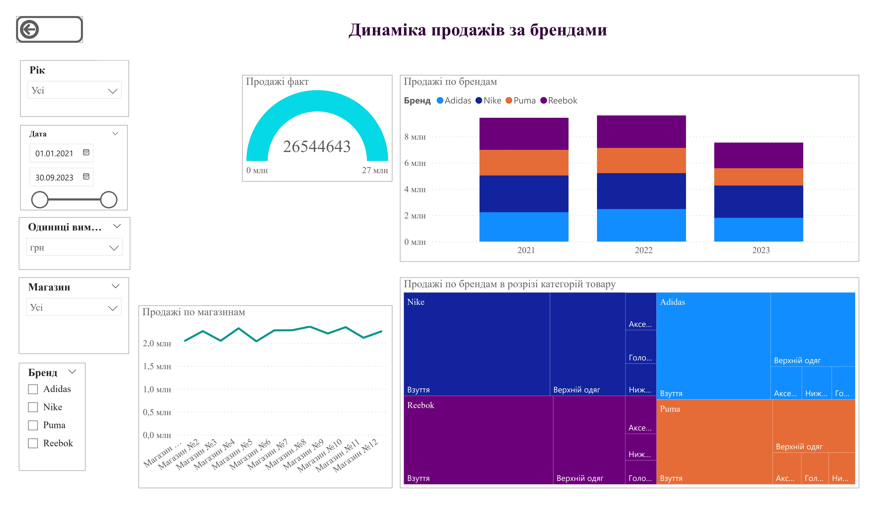
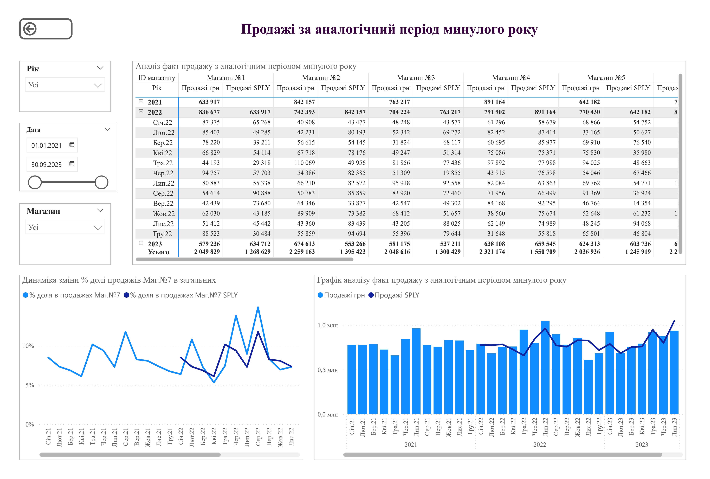
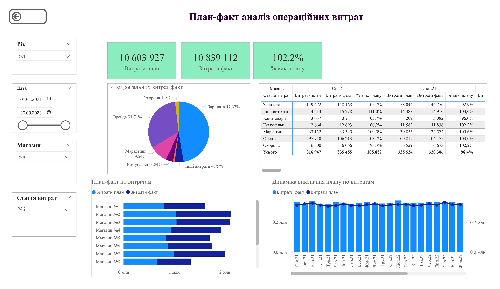
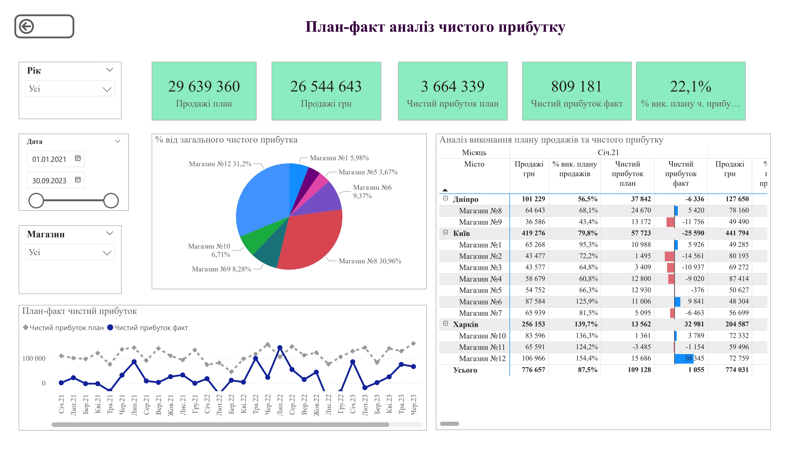
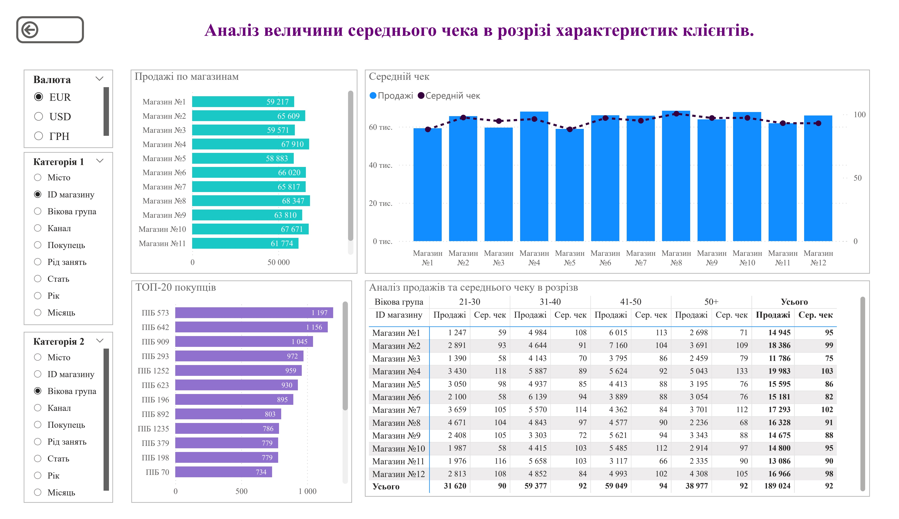
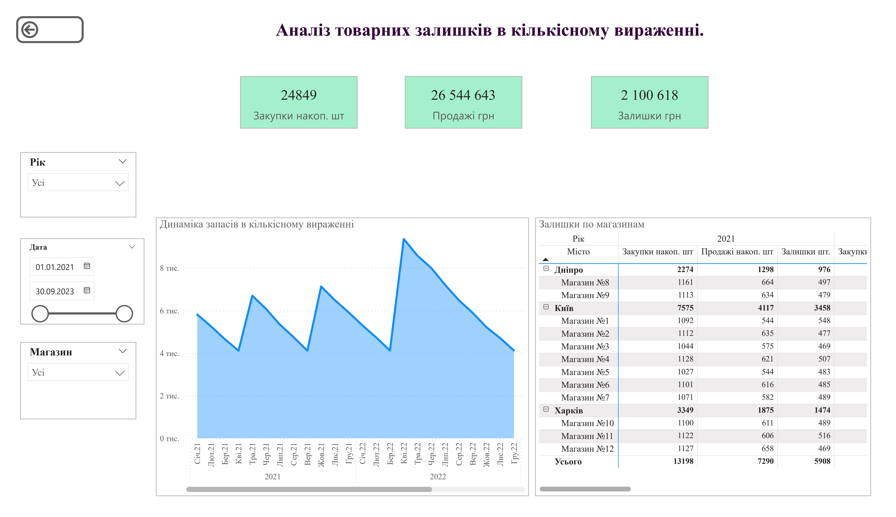

# Power-BI-Sales-Analysis

Навчальний проєкт Power BI з аналізу продажів, асортименту та клієнтських сегментів.

## 🎯 Мета проєкту
Проаналізувати продажі компанії, оцінити ефективність товарних категорій, клієнтських сегментів та товарних запасів.

## 🧰 Інструменти
- Power BI Desktop
- Power Query
- DAX
- Excel

## 📊 Основні показники
- Продажі в розрізі магазинів, брендів та категорій товарів
  
- Динаміка росту продажів по роках
  
- План-факт аналіз операційних витрат
  
- План-факт аналіз чистого прибутку
  
- Середній чек
  
- Аналіз товарних залишків
   

## 🧠 Навички, продемонстровані в проєкті
- Очищення та підготовка даних у Power Query  
- Побудова моделі даних
   
- Створення зв’язків між таблицями  
- Написання DAX-мір  
- Візуалізація даних  
- Аналіз бізнес-показників  
